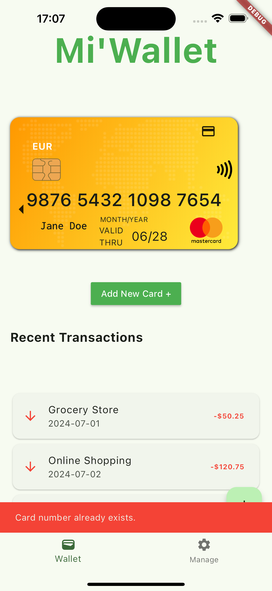

# Mi'Wallet

This app enables users to scan, validate and store their credit(s) card details

## Getting Started

This project is a starting point for a Flutter application. Follow these steps to get started:

1. Navigate to the project directory.
2. Run `flutter pub get` to install dependencies.
3. Run the Bash script with the desired flavor (dev, qa, or prod) to create the configuration file in the directory /assets/cfg/:
   sh create_app_settings.sh <flavor>
   Replace <flavor> with dev, qa, or prod.
4. Connect to a device or emulator.
5. Run the app using `flutter run`.

## Key Features

Credit Card Management:

Add Credit Card: Allows users to add new credit cards. Ensures no duplicate cards are added.
Remove Credit Card: Users can remove cards by card number.
Display Cards: Shows a list of credit cards with card details.
Save Cards Securely: Cards are saved in secure storage, and updates are handled efficiently.
Transaction Log:

Show Transactions: Displays a mock log of the last 4 transactions.
Banned and Issuing Countries:

List Banned Countries: Configurable list of banned countries, with the ability to pick from a predefined list.
List Issuing Countries: Fetches and displays a list of issuing countries.

Loading Widget: Displays a loading spinner with configurable colors.
Error Handling: Handles and displays errors related to card operations and data retrieval.
Code Refactoring and Enhancements
ViewModel Updates:

Separation of Concerns: Added separate functions for adding and saving credit cards.
Status and Error Handling: Improved status and error handling for various operations.
Validation: Added validation for loading and saving credit cards.
UI Components:

For help getting started with Flutter development, view the
[online documentation](https://docs.flutter.dev/), which offers tutorials,
samples, guidance on mobile development, and a full API reference.

# Mi-Wallet
